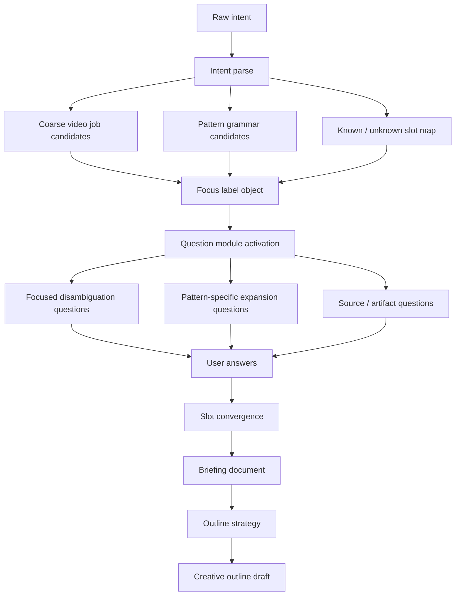

# Dynamic Intake Interaction Tree

This spec explains how Plotline should move from one raw user intent to:

1. focused labels,
2. dynamic clarification questions,
3. a briefing document,
4. and finally an outline plan.

It is written around this example prompt:

```text
I want to create a video about OpenAI customer education academy teardown.
```

The point is not to ask every possible question. The point is to use labels and pattern grammar to decide which question modules matter, then converge the answers into an outline-ready brief.

## 1. Core Principle

Pattern grammar is not just a secondary tag.

It should drive an interaction policy:

```text
raw intent
  -> focus into candidate labels
  -> activate pattern question modules
  -> ask unresolved high-impact questions
  -> converge answers into briefing slots
  -> generate outline using job skeleton + pattern moves
```

The user should experience this as a smart intake, not as a taxonomy picker.

## 2. Tree Overview



## 3. Step 1: Parse Raw Intent

Input:

```text
I want to create a video about OpenAI customer education academy teardown.
```

The parser extracts:

```json
{
  "subject": "OpenAI customer education academy",
  "action_lens": "teardown",
  "artifact": "video",
  "explicit_audience": null,
  "explicit_source": null,
  "explicit_duration": null,
  "explicit_platform": null,
  "implicit_viewer_job": "understand and learn from an example",
  "source_dependency": "high"
}
```

The important clue is `teardown`. It implies:

- the video should analyze an existing artifact,
- the outline needs criteria,
- the video likely needs evidence or source material,
- the viewer probably wants transferable lessons.

## 4. Step 2: Focus Into Labels

The system should not ask, "What video type is this?"

It should internally infer a label object:

```json
{
  "video_job": {
    "label": "explainer",
    "confidence": 0.72,
    "reason": "The user is asking for analysis and understanding, not a product walkthrough or launch."
  },
  "primary_pattern": {
    "label": "teardown_analysis",
    "confidence": 0.86,
    "reason": "The word teardown indicates deconstruction of an existing artifact."
  },
  "secondary_patterns": [
    {
      "label": "customer_education_strategy_breakdown",
      "confidence": 0.78,
      "reason": "The subject is customer education academy."
    },
    {
      "label": "operator_playbook",
      "confidence": 0.46,
      "reason": "A teardown often ends with lessons the viewer can apply."
    }
  ],
  "risk_flags": [
    "No source URL or screenshots provided.",
    "Audience is unknown.",
    "Teardown lens is ambiguous: strategy, UX, pedagogy, content architecture, or business impact."
  ]
}
```

This label object is not final output. It is a routing hypothesis for question generation.

## 5. Step 3: First Focus Questions

Before expanding too much, the system should ask questions that choose the analysis lens.

For this prompt, the first question set should be small:

```json
[
  {
    "slot": "teardown_lens",
    "question_logic": "Ask which lens should drive the teardown.",
    "example_question": "What kind of teardown do you want: content strategy, user onboarding, learning design, business/retention strategy, or a full operator breakdown?",
    "why_it_matters": "This decides the evaluation criteria and outline structure."
  },
  {
    "slot": "target_audience",
    "question_logic": "Ask who should learn from the teardown.",
    "example_question": "Who is this for: founders, customer education teams, product marketers, customer success leaders, or creators building their own academy?",
    "why_it_matters": "This changes examples, depth, and takeaways."
  },
  {
    "slot": "source_policy",
    "question_logic": "Ask what evidence the system is allowed to use.",
    "example_question": "Should I use a specific source you provide, work from your notes, or draft a source-light teardown with assumptions clearly marked?",
    "why_it_matters": "A teardown makes claims about a real artifact; unsupported claims must be controlled."
  }
]
```

These are not generic form questions. They are focus questions generated from:

- `video_job = explainer`
- `primary_pattern = teardown_analysis`
- high source dependency
- ambiguous audience
- ambiguous teardown lens

## 6. Step 4: Pattern Modules Expand The Tree

After the focus labels are set, each active pattern contributes a question module.

### 6.1 `teardown_analysis` Module

Purpose:

- Turn "teardown" from a vague analysis request into concrete evaluation criteria.

Slots it contributes:

- `teardown_object`
- `teardown_lens`
- `evaluation_criteria`
- `source_artifacts`
- `verdict_posture`
- `comparison_baseline`
- `transferable_lessons`

Question logic:

- Ask what is being evaluated.
- Ask what criteria define "good."
- Ask whether the tone should be neutral, admiring, critical, or strategic.
- Ask whether to compare against best practices or another example.

Example question shapes:

- "What are we judging it against: best-in-class academy design, onboarding effectiveness, content clarity, or business impact?"
- "Should the teardown be mostly appreciative, critical, or balanced?"
- "Do you want a scorecard/checklist at the end?"

### 6.2 `customer_education_strategy_breakdown` Module

Purpose:

- Make the teardown specific to customer education, not generic content review.

Slots it contributes:

- `customer_stage`
- `education_goal`
- `activation_or_retention_goal`
- `learner_baseline`
- `content_architecture`
- `course_or_module_structure`
- `success_metric`

Question logic:

- Ask where the academy sits in the customer journey.
- Ask whether the video should focus on onboarding, adoption, retention, expansion, or trust.
- Ask what the viewer should learn about building customer education.

Example question shapes:

- "Should we evaluate this as onboarding, product adoption, customer success, or brand trust?"
- "What should viewers learn to copy into their own academy?"
- "Do you care more about curriculum structure, activation, or content quality?"

### 6.3 `operator_playbook` Module

Purpose:

- Convert the teardown into practical takeaways.

Slots it contributes:

- `viewer_role`
- `copyable_principles`
- `do_this_not_that`
- `implementation_steps`
- `anti_patterns`

Question logic:

- Ask whether the ending should become a practical checklist.
- Ask how actionable the output should be.

Example question shapes:

- "Should the ending be a strategic verdict or a practical checklist?"
- "Do you want the video to say what OpenAI did well, or what a smaller company should copy?"

### 6.4 Optional `competitive_strategy_analysis` Module

Activate only if the user mentions competitors, benchmark, "why it works," "best in class," or market positioning.

Slots it contributes:

- `comparison_set`
- `market_context`
- `differentiation_claim`
- `strategic_takeaway`

Question logic:

- Ask what comparison is fair.
- Ask whether the video should include external examples.

## 7. Step 5: Question Selection Logic

The system should not ask every module question.

It should score candidate questions:

```text
question_score =
  downstream_impact
  x uncertainty
  x pattern_weight
  x risk_if_wrong
  - answer_cost
```

For the OpenAI academy teardown prompt, the highest-impact questions are:

1. `teardown_lens`
2. `target_audience`
3. `source_policy`
4. `verdict_posture`
5. `transferable_lessons`

Lower-priority questions can wait until after the first outline:

- exact duration,
- exact title,
- detailed visual style,
- CTA wording,
- thumbnail direction.

## 8. Step 6: Converge Answers Into Briefing Slots

Assume the user answers:

```json
{
  "teardown_lens": "customer education strategy and content architecture",
  "target_audience": "founders and customer success teams building their own academy",
  "source_policy": "use my notes and public pages only; do not add unsupported claims",
  "verdict_posture": "balanced but opinionated",
  "ending_mode": "practical checklist"
}
```

The system converges these into:

```json
{
  "video_job": "explainer",
  "primary_pattern": "teardown_analysis",
  "secondary_patterns": [
    "customer_education_strategy_breakdown",
    "operator_playbook"
  ],
  "briefing_slots": {
    "viewer_job": "Understand how OpenAI's customer education academy is structured and extract principles for building a better academy.",
    "teardown_object": "OpenAI customer education academy",
    "teardown_lens": "customer education strategy and content architecture",
    "target_audience": "founders and customer success teams",
    "evaluation_criteria": [
      "learner journey clarity",
      "content architecture",
      "activation/adoption support",
      "trust and authority",
      "copyable principles"
    ],
    "source_policy": "use user notes and public pages only; mark unsupported claims",
    "verdict_posture": "balanced but opinionated",
    "ending_mode": "practical checklist",
    "open_assumptions": [
      "Specific academy page examples need supplied sources or public-page review."
    ]
  }
}
```

## 9. Step 7: Build The Briefing Document

The briefing document should be a readable contract:

```json
{
  "working_title": "OpenAI Customer Education Academy Teardown",
  "viewer_job": "Help founders and customer success teams understand what makes a strong customer education academy and what they can copy.",
  "creator_goal": "Produce a strategic, practical teardown rather than a generic overview.",
  "point_of_view": "A great customer education academy is not just a help center; it is a guided adoption system that teaches customers what to do next.",
  "content_spine": [
    "Why customer education academies matter now",
    "What we are evaluating and what counts as good",
    "How OpenAI appears to structure the learning journey",
    "What works well in the content architecture",
    "Where the academy may fall short or leave gaps",
    "What smaller teams should copy",
    "Practical checklist for building your own academy"
  ],
  "media_grammar": [
    "screen captures of academy pages if provided",
    "scorecard overlays",
    "simple framework diagrams",
    "talking-head analysis"
  ],
  "source_policy": "source-grounded; unsupported claims must be marked",
  "must_avoid": [
    "Do not become a generic OpenAI overview.",
    "Do not make claims about internal strategy without evidence.",
    "Do not turn the video into a product demo."
  ],
  "brief_ready_level": "ready_with_assumptions"
}
```

## 10. Step 8: Use Labels In Outline Stage

The outline agent receives:

```json
{
  "video_job": "explainer",
  "primary_pattern": "teardown_analysis",
  "secondary_patterns": [
    "customer_education_strategy_breakdown",
    "operator_playbook"
  ],
  "briefing_document": "approved brief"
}
```

The outline is generated from three layers:

### 10.1 Video Job Skeleton: `explainer`

Required structure:

- establish why the topic matters,
- define the question,
- build a clear explanatory progression,
- resolve a misconception,
- end with a takeaway or decision.

### 10.2 Primary Pattern Moves: `teardown_analysis`

Adds:

- define evaluation criteria early,
- map the artifact,
- evaluate strengths and gaps,
- include verdict posture,
- show what is transferable.

### 10.3 Secondary Pattern Moves

`customer_education_strategy_breakdown` adds:

- customer journey stage,
- learner baseline,
- curriculum/content architecture,
- adoption/retention lens.

`operator_playbook` adds:

- practical checklist,
- do-this-not-that takeaways,
- copyable principles.

## 11. Example Outline Strategy

```text
Section 1 - Why Customer Education Is a Growth Lever
Purpose: Explain why an academy matters beyond support documentation.
Pattern source: explainer skeleton.

Section 2 - What We Are Judging: The Teardown Scorecard
Purpose: Define the evaluation criteria before judging OpenAI.
Pattern source: teardown_analysis.

Section 3 - The Learning Journey: How The Academy Guides A Customer
Purpose: Map the academy from a learner's point of view.
Pattern source: customer_education_strategy_breakdown.

Section 4 - What Works: Authority, Structure, And Adoption Cues
Purpose: Identify the strongest strategic choices.
Pattern source: teardown_analysis + customer_education_strategy_breakdown.

Section 5 - What Might Be Missing Or Hard To Copy
Purpose: Keep the teardown honest and useful.
Pattern source: teardown_analysis.

Section 6 - What Smaller Teams Should Copy
Purpose: Translate the teardown into operator lessons.
Pattern source: operator_playbook.

Section 7 - Build Your Own Academy Checklist
Purpose: End with practical implementation guidance.
Pattern source: operator_playbook.
```

## 12. Interaction Path In One Sentence

For this example:

```text
"OpenAI customer education academy teardown"
  -> explainer
  -> teardown_analysis + customer_education_strategy_breakdown + operator_playbook
  -> ask lens/audience/source/verdict/actionability questions
  -> synthesize briefing document
  -> generate explainer outline with teardown scorecard + customer education lens + operator checklist
```

